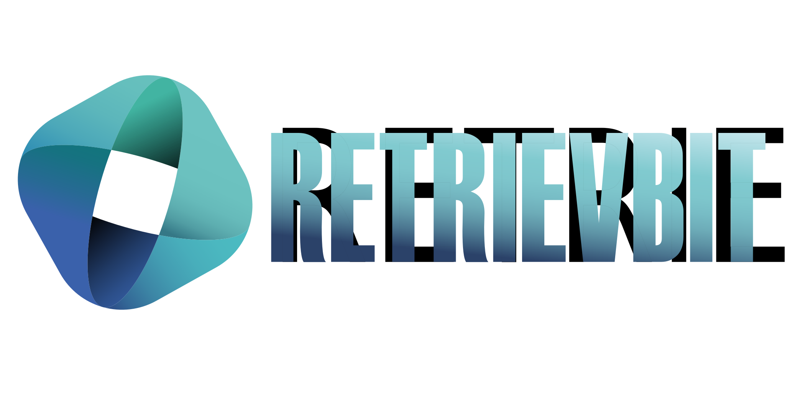

# Retrievbit

<div align="center">
  
  <p>Modern, multilingual content platform built with Astro</p>
</div>

---

[](https://github.com/astrogon/astrogon/blob/main/LICENSE) [](https://github.com/astrogon/astrogon)  [](https://astrogon.reednel.com/)

> **Note**: This project is a fork of [Astrogon](https://github.com/astrogon/astrogon), a multipurpose website template built with Astro JS, Tailwind, and React. We've customized it to create a modern multilingual content platform for Retrievbit.

## 📖 About Retrievbit

Retrievbit is a knowledge platform focused on petroleum engineering, geosciences, and technologies. Our mission is to provide high-quality educational content and technical resources for professionals and students in the energy sector.

🌐 **Live Demo**: [retrievbit.pages.dev](https://retrievbit.pages.dev)

## 🚀 Features

### 🌐 Multilingual Support

- **English & Spanish** content out of the box
- Easy to add more languages
- Automatic language detection and switching
- SEO-optimized URLs for each language

### 📚 Content Collections

- **Training & Education**
  - Comprehensive learning materials
  - Structured courses and modules
  - Practical examples and exercises
  - Bilingual content support

- **Blog**
  - Categories and Tags for organization
  - Featured posts support
  - Reading time estimation
  - Author profiles

- **Tutorials**
  - Step-by-step guides
  - Practical examples
  - Code snippets and demos
  - Print-friendly versions

- **Concepts**
  - Technical explanations
  - Industry terminology
  - Related concepts linking
  - Responsive design for all devices

- **About & Team**
  - Company information
  - Team member profiles
  - Mission and values
  - Contact information

#### Content Components & Features

- **Accordion**/collapsible section
- **Tabs** section
- **Code Block** with syntax highlighting
- **Quote Block**
- **Notice Blocks** - note, tip, info, & warning
- **Embedded YouTube Video**
- Integrated **LaTeX** support for inline and block mathematical expressions
- All the standard **MD/MDX** features, including footnotes, tables, and more

### ✨ Key Features

- **Dark/Light Mode**
  - Automatic system preference detection
  - Smooth theme switching
  - Persistent user preference

- **Enhanced Content Discovery**
  - Full-text search across all content
  - Related content suggestions
  - Table of contents with smooth scrolling
  - Category and tag filtering

- **Performance Optimized**
  - Blazing fast page loads with Astro
  - Optimized images and assets
  - Lazy loading for better performance
  - Minimal JavaScript footprint

- **Developer Experience**
  - Clean, modular codebase
  - TypeScript support
  - Component-based architecture
  - Easy theming system

- **SEO & Social**
  - SEO-optimized structure
  - Open Graph and Twitter cards
  - Sitemap generation
  - RSS feed support

Every one of these features was designed with modularity and customizability in mind, for the smoothest development experience possible. For more details, see [docs/customization.md](docs/customization.md).

## Recommended Technologies

- [Git](https://git-scm.com)
- [Node Version Manager](https://github.com/nvm-sh/nvm)
- [Visual Studio Code](https://code.visualstudio.com/)

See [docs/tech-stack.md](docs/tech-stack.md) for more details.

## Development Instructions

1. Fork this repository to your own GitHub account, then clone it to your local machine
2. Use Node 22: `nvm install 22` or `nvm use 22`
3. From the project directory, install Node dependencies: `npm install`
4. From the project directory, build: `npm run dev`
   1. Alternately*: `npx astro build`, `npx wrangler dev`
5. See your changes live at `http://localhost:4321`

> *This is relevant if you intend to deploy your site to Cloudflare. Starting with Astro 5.8, Node 18 is unsupported, but the old Cloudflare Pages uses 18 by default. Wrangler appears to be necessary to use the new Cloudflare Workers. Read more about [Astro deployment on Cloudflare](https://docs.astro.build/en/guides/deploy/cloudflare/#cloudflare-workers).

## 🛠️ Getting Started

### Prerequisites

- Node.js 18+
- npm or yarn
- Git

### Installation

1. Clone the repository:

   ```bash
   git clone https://github.com/luiscm17/retrievbit.git
   cd retrievbit
   ```

2. Install dependencies:

   ```bash
   npm install
   # or
   yarn
   ```

3. Start the development server:

   ```bash
   npm run dev
   # or
   yarn dev
   ```

4. Open your browser to `http://localhost:4321`

## 🚀 Deployment

Deploy to your favorite platform:

- [Vercel](https://vercel.com)
- [Netlify](https://www.netlify.com/)
- [Cloudflare Pages](https://pages.cloudflare.com/)
- Or any static hosting service

## 📝 License

This project uses a dual-license system:

- **Source Code**: [MIT License](LICENSE) - For all project code except the `/src/content/` directory
- **Content**: [CC BY-NC-ND 4.0](LICENSE-CONTENT) - For all material in the `/src/content/` directory (articles, tutorials, documentation)

### Content License Details

Content in `/src/content/` is licensed under **Creative Commons Attribution-NonCommercial-NoDerivatives 4.0 International**. This means you can:

- **Share** — copy and redistribute the material in any medium or format

Under the following terms:

- **Attribution** — You must give appropriate credit
- **NonCommercial** — You may not use the material for commercial purposes
- **NoDerivatives** — If you remix, transform, or build upon the material, you may not distribute the modified material

[View full terms](LICENSE-CONTENT)

## 🙏 Acknowledgments

Retrievbit is a customized fork of [Astrogon](https://github.com/astrogon/astrogon), created by [reednel](https://github.com/reednel). Special thanks to the original authors and contributors for their work on this amazing template.

Original Astrogon was inspired by:

- [astroplate](https://github.com/zeon-studio/astroplate) by zeon-studio
- [astro-design-system](https://github.com/jordienr/astro-design-system) by jordienr
- [manual](https://github.com/TheOtterlord/manual) by TheOtterlord

## 👥 Contributing

Contributions are welcome! Please follow these guidelines:

1. **For source code**:
   - Ensure changes comply with the MIT license
   - Follow existing code conventions

2. **For content**:
   - All new content must follow the CC BY-NC-ND 4.0 license
   - Provide proper attribution for any third-party content
   - Maintain consistent formatting with existing content

3. **Process**:
   - Fork the repository
   - Create a feature branch (`git checkout -b feature/AmazingFeature`)
   - Commit your changes (`git commit -m 'Add some AmazingFeature'`)
   - Push to the branch (`git push origin feature/AmazingFeature`)
   - Open a Pull Request

### 📚 Content Style Guide

- Use Markdown for content formatting
- Keep headings and titles consistent
- Include practical examples where relevant
- Ensure all technical content is accurate and up-to-date
- Provide references for data and technical claims
