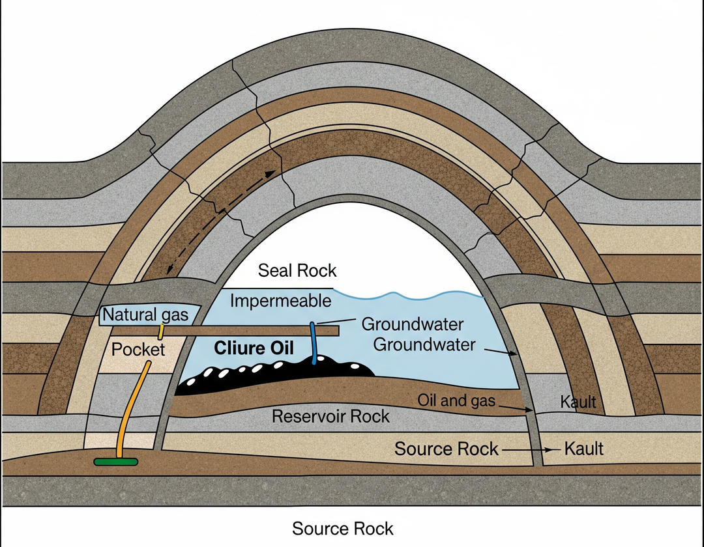
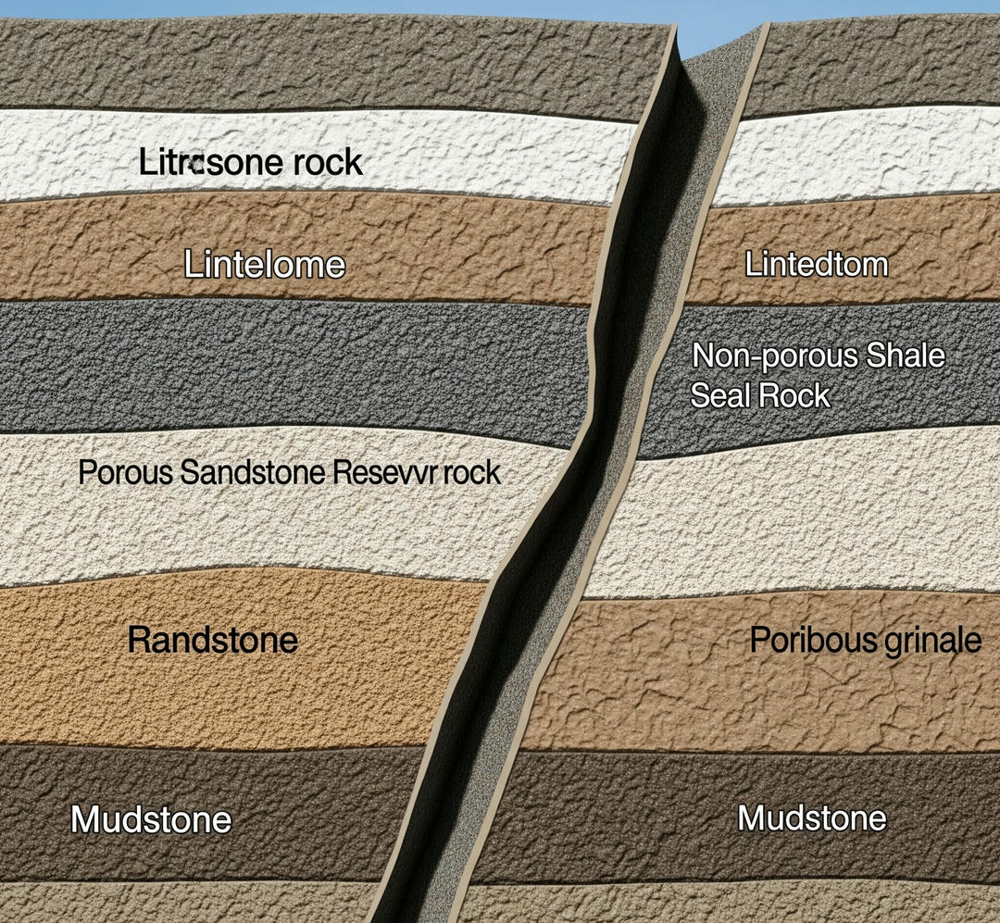
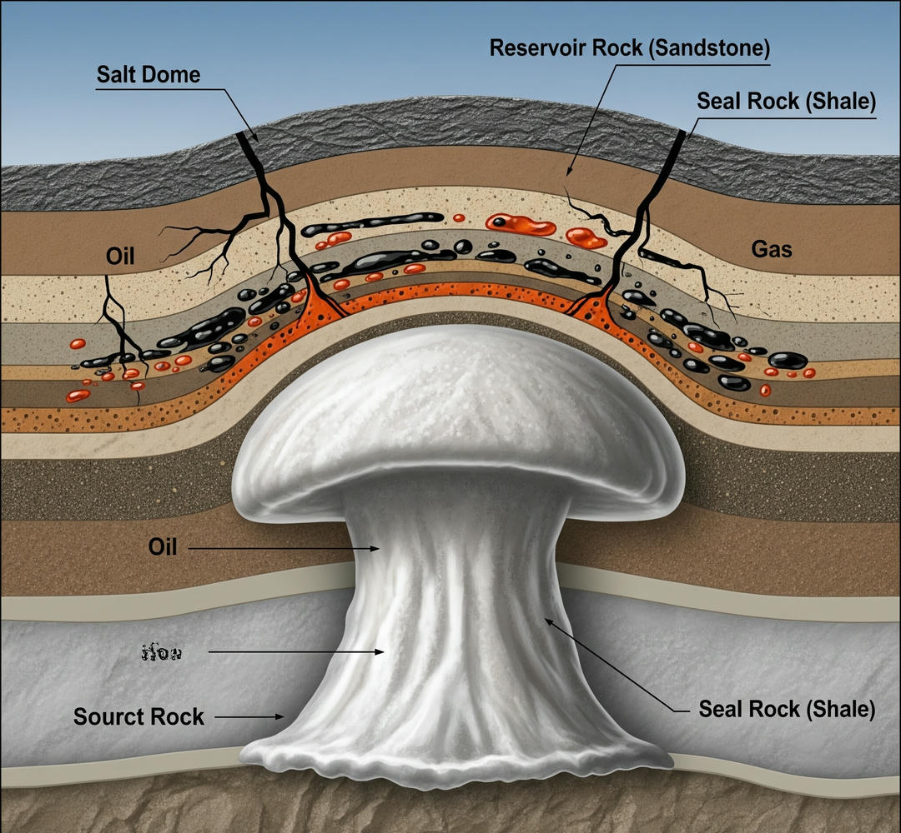
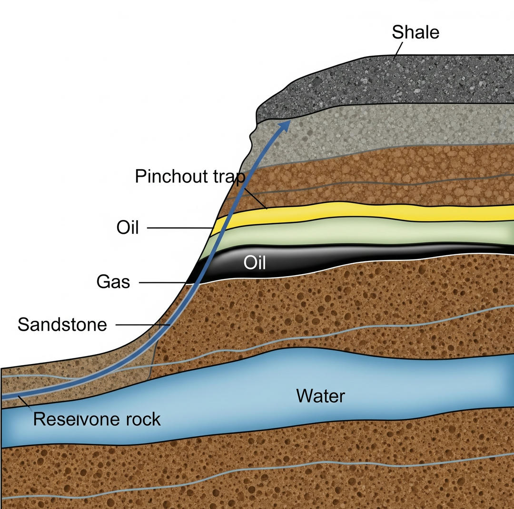
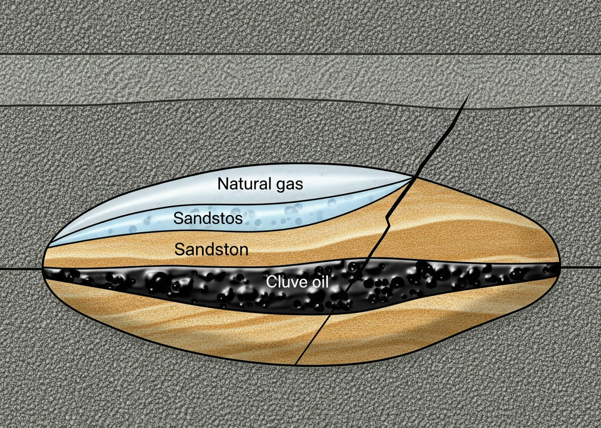
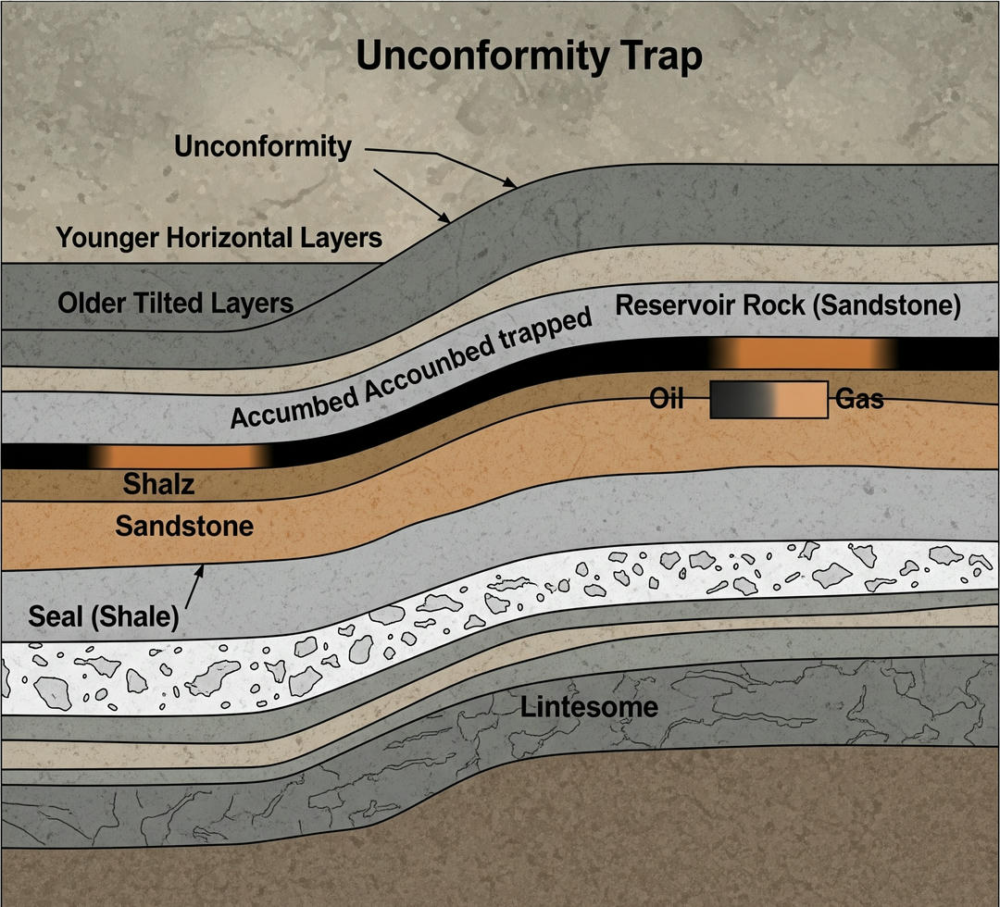

---

title: "Basic Petroleum Geology Essential: Traps and Rocks"
description: An introduction to the fundamentals of petroleum geology, focusing on the types of geological traps (structural and stratigraphic) and the differences between source and reservoir rocks. This chapter explains how these elements allow for the accumulation of hydrocarbons and their relevance for drilling. 
image: "@assets/training/drilling/basic-petroleum-geology/cover.jpg" 
imageAlt: "Cover of the chapter on basic petroleum geology" 
pubDate: 2025-08-02 
modDate: 2025-08-02 
chapter: 3 
module: 1

---

Petroleum geology is the science that guides the exploration and drilling of hydrocarbons, helping us understand where and how oil and gas accumulate in the subsurface. In this section, we will explore the fundamental concepts of geological traps and the essential rocks that form a petroleum system. Traps, whether structural or stratigraphic, are configurations that concentrate hydrocarbons, while source and reservoir rocks play complementary roles in the formation and storage of these resources. Understanding these concepts is crucial for connecting historical and technological advances with the properties of formations and drilling equipment.

## Types of Geological Traps

Hydrocarbons are not uniformly distributed in the subsurface; they accumulate in specific geological configurations known as traps. A trap is a structure that traps oil or gas, preventing them from migrating to the surface. For a trap to be effective, it must be combined with an impermeable seal rock that retains the hydrocarbons. Traps are classified into two main categories: structural and stratigraphic.

### Structural Traps

Structural traps are formed by deformations in the Earth's crust, such as folds or faults, caused by tectonic forces. These traps are the most common in conventional reservoirs and are usually easy to identify through seismic surveys. The main types include:

1. **Anticlines**: Arch-shaped folds where rock layers curve upwards. Oil and gas, being less dense than water, accumulate at the top of the fold, trapped by a seal rock, such as shale. An example is the Ghawar field in Saudi Arabia, the world's largest oil field, which is located in an anticlinal trap.

    

2. **Fault traps**: Occur when a fracture in the crust displaces rock layers, creating a barrier that traps hydrocarbons against a seal rock. These traps are common in tectonically active regions, such as the North Sea.

    

3. **Salt domes**: Formed by the movement of salt domes that deform the overlying rock layers, creating traps. These are common in the Gulf of Mexico, where salt domes have generated prolific reservoirs.

    

### Stratigraphic Traps

Stratigraphic traps are formed by changes in rock properties, such as porosity or permeability, without the need for tectonic deformations. These traps are more difficult to detect as they depend on sedimentary variations. The main types include:

1. **Pinchouts**: Occur when a reservoir rock layer, such as sandstone, gradually thins out and is sealed by an impermeable rock, such as shale. This type of trap is common in sedimentary basins, such as the Santos Basin in Brazil.

    

2. **Lens traps**: Formed by isolated bodies of porous rock (like sandstones) surrounded by impermeable rocks. These traps are typical in ancient deltas or marine environments.

    

3. **Unconformity traps**: Occur when an impermeable layer covers an eroded surface, trapping hydrocarbons underneath. An example is the East Texas field in the United States.

    

Combined traps, which mix structural and stratigraphic elements, are also common. For example, an anticline may be limited by a pinchout, increasing the complexity of the reservoir. The identification of traps requires integrating seismic data, well logs, and geological maps, which directly connects to mapping concepts.

-----

## Source Rocks vs. Reservoir Rocks

A petroleum system requires two essential types of rocks: source rocks, which produce the hydrocarbons, and reservoir rocks, which contain them. These rocks, along with a seal rock, are the pillars of a viable reservoir.

### Source Rocks

Source rocks are formations rich in organic matter that, under conditions of high pressure and temperature for millions of years, transform this matter into oil or gas. These rocks are usually shales or schists rich in kerogen, an organic substance derived from the remains of plants and microorganisms. The generation process occurs in the "oil window" (60-120°C) or the "gas window" (120-200°C), depending on depth and geothermal conditions.

A prominent example is the Vaca Muerta formation in Argentina, an organic-rich shale that has generated large quantities of unconventional oil and gas. Source rocks are not usually porous or permeable, so hydrocarbons migrate to more permeable reservoir rocks, a process known as primary migration.

### Reservoir Rocks

Reservoir rocks are porous and permeable formations that act as reservoirs where hydrocarbons accumulate. The most common are sandstones and carbonates (such as limestones or dolomites), which have interconnected pores that allow for the storage and flow of fluids. Porosity measures the storage capacity, while permeability indicates the ease with which hydrocarbons can move through the rock.

For example, in the Maracaibo field in Venezuela, the sandstones of the Misoa formation serve as the reservoir rock, accumulating oil migrated from nearby source shales. An effective reservoir rock must be sealed by an impermeable rock, such as shale or evaporite, to prevent the loss of hydrocarbons.

The following table compares the characteristics of source and reservoir rocks:

| **Rock Type** | **Characteristics** | **Example** | **Role in the Petroleum System** |
|-------------------|---------------------------------------------|--------------------------|------------------------------------------|
| Source            | Rich in organic matter, low porosity        | Vaca Muerta Shale        | Produces hydrocarbons                    |
| Reservoir         | Porous, permeable, stores fluids            | Misoa Sandstone          | Contains hydrocarbons for extraction     |
| Seal              | Impermeable, retains hydrocarbons           | La Luna Shale            | Prevents migration to the surface        |

-----

## Summary

Petroleum geology is the basis for identifying and exploiting hydrocarbon reservoirs. Structural traps, such as anticlines, and stratigraphic traps, such as pinchouts, concentrate oil and gas, while source rocks produce these resources and reservoir rocks contain them. The seal rock completes the system, ensuring that hydrocarbons remain trapped. These concepts are fundamental to understanding how to plan drilling and how the properties of formations affect drilling operations.

-----

## Questions

1. **Reflection question**: Why do you think structural traps are easier to detect than stratigraphic traps, and how might this affect the planning of a well?
2. **Research task**: Investigate a known reservoir (for example, the Permian Basin in the US) and write a paragraph describing the type of trap and the source and reservoir rocks involved.
3. **Technical question**: Explain the difference between porosity and permeability in a reservoir rock, and why both are essential for a productive reservoir.

-----

## Bibliography

- **Books used**:

  - Hyne, N.J. (2012). *Nontechnical Guide to Petroleum Geology, Exploration, Drilling & Production*. PennWell Books.
        Provides a clear explanation of traps and rocks in petroleum systems.
  - Selley, R.C., & Sonnenberg, S.A. (2014). *Elements of Petroleum Geology*. Academic Press.
        Details the types of traps and the properties of source and reservoir rocks.

- **Recommended books**:

  - Bjorlykke, K. (2015). *Petroleum Geoscience: From Sedimentary Environments to Rock Physics*. Springer.
        A technical resource on petroleum geology. Available at: [https://www.springer.com/gp/book/9783642341311](https://www.springer.com/gp/book/9783642341311).
  - Gluyas, J., & Swarbrick, R. (2004). *Petroleum Geoscience*. Blackwell Publishing.
        Ideal for understanding traps and petroleum systems. Available at: [https://www.wiley.com/en-us/Petroleum+Geoscience-p-9780632038480](https://www.wiley.com/en-us/Petroleum+Geoscience-p-9780632038480).

- **Direct links**:

  - SPE (Society of Petroleum Engineers): Resources on petroleum geology. [https://www.spe.org/en/](https://www.spe.org/en/).
  - AAPG (American Association of Petroleum Geologists): Information on traps and rocks. [https://www.aapg.org/](https://www.aapg.org/).
  - PetroSkills: Courses on the fundamentals of petroleum geology. [https://www.petroskills.com/en/training/courses/petroleum-geology-for-non-geologists---ng](https://www.petroskills.com/en/training/courses/petroleum-geology-for-non-geologists---ng).
  