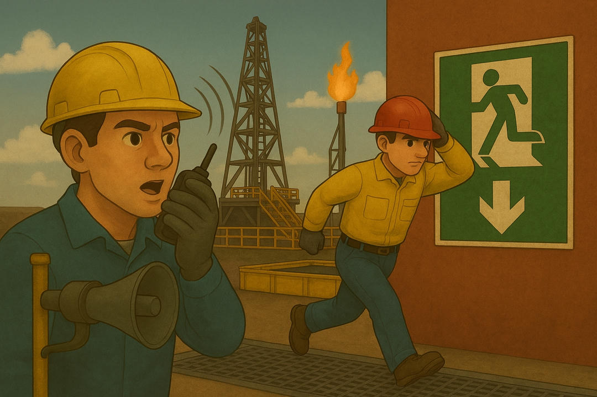

Oil drilling, whether onshore or offshore, is a high-risk operation where safety and effective communication are critical to protecting personnel, equipment, and the environment. This chapter focuses on Health, Safety, and Environment (HSE) protocols and communication practices, such as *pre-job meetings*, which ensure coordination between drilling and support teams. These processes are essential for mitigating risks like kicks, spills, or injuries, connecting geological fundamentals, well types, and equipment with case studies of failures and future trends.

---

## Importance of Safety and Communication

The drilling site is a dynamic environment where risks are inherent: high reservoir pressures, heavy equipment like the derrick or drawworks, and extreme environmental conditions in offshore operations. HSE protocols establish standards to minimize these risks, while effective communication ensures that everyone, from the *Company Man* to the *roughnecks*, is aligned on objectives and procedures. Safety meetings (*pre-job meetings*) are a key pillar, integrating technical planning with operational execution.

### HSE Protocols

Health, Safety, and Environment (HSE) protocols are standards designed to protect personnel, prevent environmental damage, and comply with local and international regulations, such as those from the API (American Petroleum Institute) or the BSEE (*Bureau of Safety and Environmental Enforcement*). These protocols cover all phases of the well lifecycle.

  

**Key components of HSE protocols**:

1. **Personnel safety**: Mandatory use of personal protective equipment (PPE), such as helmets, fire-resistant gloves, and steel-toe boots. For example, in a rig in the Permian Basin, workers use masks to protect against gases like H₂S.
2. **Operational risk control**: Regular inspections of equipment like blowout preventers (BOPs) to prevent kicks or blowouts.
3. **Environmental protection**: Management of mud or hydrocarbon spills, using containment systems and water-based muds compatible with regulations.
4. **Training**: Ongoing training in emergency procedures, such as evacuations or well control, especially on offshore platforms.
5. **Regulatory compliance**: Audits to ensure operations meet standards, such as environmental permits required during planning.

For example, on a *jack-up* rig in the Gulf of Mexico, HSE protocols include weekly well control drills to prepare the team for a potential kick.

### Safety Meetings (*Pre-job Meetings*)

Safety meetings, or *pre-job meetings*, are daily or pre-critical-task sessions where the team reviews procedures, identifies risks, and coordinates actions. These meetings are led by the *Toolpusher* or *Company Man* and involve all roles, including mud engineers, cementing specialists, and wellsite geologists.

**Objectives of *pre-job meetings***:

1. **Plan review**: Discuss the day’s drilling plan, such as adjusting the weight on bit (WOB) for hard formations.
2. **Risk identification**: Analyze potential issues, such as unstable shales or abnormal pressures, based on geological data.
3. **Role assignment**: Clarify each member’s responsibilities, ensuring the *Driller* and *roughnecks* are synchronized.
4. **Emergency protocols**: Review procedures for kicks, fires, or evacuations, including the use of BOPs or offshore escape systems.
5. **Effective communication**: Establish clear channels, such as radios or digital systems, to report anomalies in real-time.

For example, before drilling a directional well in Vaca Muerta, a *pre-job meeting* might include the wellsite geologist explaining the target trajectory, the mud engineer adjusting fluid density, and the *Toolpusher* assigning shifts to ensure continuity.

### Interdisciplinary Collaboration in Safety

Safety relies on collaboration among all roles at the drilling site. For example:

- The wellsite geologist alerts about unstable formations, such as reactive shales, which could cause collapses.
- The mud engineer adjusts the drilling fluid to stabilize the well, reducing risks of stuck pipe.
- The *Company Man* ensures safety measures comply with regulatory permits, while the *Toolpusher* implements protocols on-site.
- The *Driller* monitors real-time pressure indicators, reporting anomalies to the *Toolpusher*.

This collaboration is reinforced in *pre-job meetings*, where technical data (such as MWD logs) and operational observations are integrated to make informed decisions.

The following table summarizes the key elements of safety and communication:

| Aspect                     | Description                                      | Primary Responsible           | Example Application                   |
|--------------------------------|----------------------------------------------------|-----------------------------------|------------------------------------------|
| HSE Protocols                  | Standards to protect personnel and environment      | Company Man, Toolpusher           | Well control drills                      |
| Pre-job Meetings               | Meetings to plan and mitigate risks                | Toolpusher, Company Man           | Review of trajectory in directional well |
| Interdisciplinary Collaboration | Coordination among roles for safe decisions         | All roles                         | Mud adjustment based on geological data  |

---

## Summary

Communication and safety at the drilling site are pillars that integrate the technical and human aspects of oil drilling. HSE protocols establish standards to protect personnel, equipment, and the environment, while *pre-job meetings* ensure effective coordination among roles like the *Company Man*, *Toolpusher*, *Driller*, and support teams. These processes connect geological fundamentals, well types, equipment, and the well lifecycle with case studies of failures and future trends.

---

## Practical Exercise

1. **Reflection question**: Why do you think *pre-job meetings* are essential for preventing accidents on a drilling rig, and how could they improve operational efficiency?
2. **Research task**: Investigate a drilling incident (e.g., the Deepwater Horizon accident) and write a paragraph (5-7 lines) describing how better communication or HSE protocols could have prevented it.
3. **Technical question**: Explain how HSE protocols and *pre-job meetings* work together to mitigate the risk of a kick during drilling.

---

## Bibliography

- **Books used**:
  - Hyne, N.J. (2012). *Nontechnical Guide to Petroleum Geology, Exploration, Drilling & Production*. PennWell Books.  
    Explains safety protocols and communication in drilling in an accessible manner.
  - Bourgoyne, A.T., Millheim, K.K., Chenevert, M.E., & Young, F.S. (1986). *Applied Drilling Engineering*. SPE Textbook Series.  
    Details HSE procedures and risk management on the rig.

- **Recommended books**:
  - Mitchell, R.F., & Miska, S.Z. (2011). *Fundamentals of Drilling Engineering*. SPE Textbook Series.  
    A technical resource on safety and communication in drilling. Available at: [https://store.spe.org/Fundamentals-of-Drilling-Engineering-P113.aspx](https://store.spe.org/Fundamentals-of-Drilling-Engineering-P113.aspx).
  - Azar, J.J., & Samuel, G.R. (2007). *Drilling Engineering*. PennWell Books.  
    Ideal for deepening knowledge on HSE protocols. Available at: [https://www.pennwellbooks.com/drilling-engineering/](https://www.pennwellbooks.com/drilling-engineering/).

- **Direct links**:
  - SPE (Society of Petroleum Engineers): Resources on drilling safety. [https://www.spe.org/en/](https://www.spe.org/en/).
  - IADC (International Association of Drilling Contractors): Information on HSE protocols and communication. [https://www.iadc.org/](https://www.iadc.org/).
  - PetroSkills: Courses on drilling operations safety. [https://www.petroskills.com/en/training/courses/health-safety-environment---hse](https://www.petroskills.com/en/training/courses/health-safety-environment---hse).
  