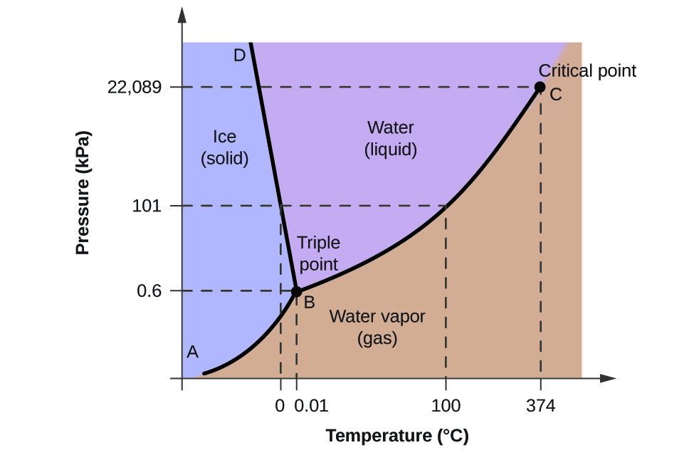

Imagine hydrocarbons as actors on a stage, changing their roles from liquid to gas depending on the pressure and temperature around them. Understanding **hydrocarbon phase behavior** is like reading the script of this performance—it tells us how oil and gas behave in the reservoir and at the surface, guiding critical decisions in production engineering. In this chapter, we’ll explore **P-T (pressure-temperature)** and **P-V (pressure-volume)** diagrams, identify critical points, and see how these concepts apply to surface separation. We’ll compare **gas condensate** and **black oil** reservoirs to bring the theory to life, using real-world examples and some math to make it crystal clear.

## What is Hydrocarbon Phase Behavior?

Hydrocarbon phase behavior describes how oil and gas change between liquid and gas phases under varying conditions of pressure and temperature. In a reservoir, hydrocarbons exist as a mixture of liquid (oil), gas, and sometimes water, and their behavior depends on their composition (e.g., methane, ethane, heavier hydrocarbons) and the environment they’re in.

Think of it like cooking: just as water boils or freezes at specific temperatures and pressures, hydrocarbons shift phases in predictable ways. Production engineers use this knowledge to design wells, separators, and pipelines that handle these fluids efficiently.

### Key Concepts

- **Phases**: Hydrocarbons can be liquid, gas, or a mix of both, depending on pressure and temperature.
- **Phase Diagrams**: Tools like P-T and P-V diagrams map out these changes, showing where hydrocarbons are liquid, gas, or a two-phase mixture.
- **Applications**: Phase behavior guides surface separation (splitting oil, gas, and water) and helps predict reservoir performance.

## P-T Diagrams: Mapping the Phase Changes

A **P-T diagram** plots pressure against temperature to show the conditions under which hydrocarbons exist as liquid, gas, or both. It’s a roadmap for understanding phase transitions in reservoirs and surface facilities.

### Key Features of a P-T Diagram

- **Bubble Point Curve**: The boundary where a liquid starts to form gas bubbles as pressure drops.
- **Dew Point Curve**: The boundary where a gas starts to condense into liquid as pressure drops or temperature changes.
- **Critical Point**: The pressure and temperature where liquid and gas phases become indistinguishable (no clear boundary).
- **Two-Phase Region**: Inside the bubble and dew point curves, where liquid and gas coexist.

<Notice type="info">**Did You Know?** The critical point is unique for each hydrocarbon mixture, depending on its composition. For example, methane-rich gas has a lower critical temperature than heavy oil.</Notice>

### Example P-T Diagram



In this diagram, imagine a reservoir at high pressure and temperature (point A). As fluids flow to the surface, pressure and temperature drop (point B), entering the two-phase region where gas and liquid coexist. This is critical for designing separators to handle both phases.

### Math Insight: Bubble Point Pressure

The bubble point pressure $$P_b$$ is where gas starts to form in a liquid. It can be estimated using correlations like Standing's equation for oil:

<div class="math-wrapper">
```math
P_b = 18.2 \cdot \bigg[ \bigg(\frac{R_s}{\gamma}\bigg)^{0.83} \cdot 10^{(0.00091 \cdot T - 0.0125 \cdot \text{API})} - 1.4 \bigg]
```
</div>

Where:
- $$P_b$$: Bubble point pressure (psia)
- $$R_s$$: Gas-oil ratio (SCF/STB)
- $$\gamma$$: Gas specific gravity
- $$T$$: Temperature (°F)
- $$\text{API}$$: Oil API gravity

This equation helps production engineers predict when gas will separate from oil, impacting separator design.

## P-V Diagrams: Volume Changes Under Pressure

A **P-V diagram** plots pressure against specific volume (volume per unit mass) at a constant temperature, showing how hydrocarbons compress or expand.

### Key Features of a P-V Diagram

- **Liquid Region**: High pressure, low volume, where hydrocarbons are incompressible.
- **Gas Region**: Low pressure, high volume, where hydrocarbons are highly compressible.
- **Two-Phase Region**: Where liquid and gas coexist, with volume changing significantly as pressure drops.
- **Critical Point**: The point where liquid and gas properties merge.

<Notice type="tip">**Pro Tip**: P-V diagrams are crucial for designing pipelines, as they show how much gas expands as pressure drops, affecting flow rates and pipe sizing.</Notice>

### Math Insight: Gas Formation Volume Factor

The gas formation volume factor $$B_g$$ relates gas volume at reservoir conditions to surface conditions:

<div class="math-wrapper">
```math
B_g = \frac{0.00504 \cdot z \cdot T}{P}
```
</div>

Where:
- $$B_g$$: Gas formation volume factor (ft³/SCF)
- $$z$$: Gas compressibility factor
- $$T$$: Temperature (°R, where °R = °F + 460)
- $$P$$: Pressure (psia)

This factor is used to calculate how much gas expands from reservoir to surface, critical for flowline design.

## Applications in Surface Separation

Phase behavior directly impacts **surface separation**, where oil, gas, and water are split for processing. Production engineers use P-T diagrams to:

- **Design Separators**: Set pressure and temperature conditions to maximize liquid recovery. For example, operating near the bubble point ensures most gas stays dissolved in oil until separation.
- **Prevent Problems**: Avoid conditions where hydrates or paraffins form, which can clog equipment.
- **Optimize Efficiency**: Adjust separator stages (e.g., high-pressure and low-pressure separators) to capture more gas or oil.

For example, in the North Sea, engineers use P-T diagrams to design multi-stage separators for volatile oils, ensuring maximum liquid recovery.

## Case Study: Gas Condensate vs. Black Oil Reservoirs

Let’s compare two types of reservoirs to see phase behavior in action:

<div class="table-wrapper">
| Aspect                | Gas Condensate                              | Black Oil                                  |
|-----------------------|---------------------------------------------|--------------------------------------------|
| Composition           | High in light hydrocarbons (methane, ethane) | High in heavier hydrocarbons                 |
| P-T Diagram           | Large two-phase region, near dew point      | Smaller two-phase region, near bubble point |
| Behavior              | Gas at reservoir, liquid condenses at surface | Liquid at reservoir, gas forms at surface   |
| Example               | North Field (Qatar)                         | Ghawar (Saudi Arabia)                       |
</div>

- **Gas Condensate (North Field)**: At reservoir conditions, the fluid is a gas. As it reaches the surface, pressure drops below the dew point, causing liquid (condensate) to form. Engineers design separators to capture this valuable liquid.
- **Black Oil (Ghawar)**: The fluid is liquid in the reservoir. As pressure drops during production, gas bubbles form below the bubble point. Engineers optimize separators to handle high gas-oil ratios.

<Notice type="warning">**Caution**: Misjudging phase behavior can lead to inefficient separation or equipment damage, like gas locking in pumps. Always use accurate P-T data!</Notice>

## Putting It Into Practice

Imagine you’re a production engineer in the North Field. You analyze a P-T diagram and see the reservoir is near the dew point. You design a separator to operate at a pressure that maximizes condensate recovery. Using Standing’s equation, you calculate the bubble point to ensure the separator handles the gas-liquid transition correctly. Meanwhile, in Ghawar, you adjust separator conditions to manage high gas production from a black oil reservoir, preventing pipeline blockages.

## Summary

Hydrocarbon phase behavior, mapped through P-T and P-V diagrams, is the foundation for understanding how oil and gas move from reservoir to surface. By identifying critical points, bubble points, and dew points, production engineers design efficient separation systems and optimize production. Comparing gas condensate and black oil reservoirs highlights how phase behavior shapes real-world operations, from Qatar’s North Field to Saudi Arabia’s Ghawar.

## Questionnaire

1. **What does the bubble point represent on a P-T diagram?**  
  - a) The point where gas and liquid phases merge.  
  - b) The pressure where gas starts to form in a liquid.  
  - c) The temperature where hydrocarbons become gas.  
  - **Answer**: b) The pressure where gas starts to form in a liquid.

2. **Why are P-V diagrams important for production engineering?**  
  - a) They predict reservoir pressure changes.  
  - b) They show how hydrocarbon volume changes with pressure.  
  - c) They calculate the critical point of water.  
  - **Answer**: b) They show how hydrocarbon volume changes with pressure.

3. **How does a gas condensate reservoir differ from a black oil reservoir?**  
  - a) Gas condensate is liquid in the reservoir, black oil is gas.  
  - b) Gas condensate forms liquid at the surface, black oil forms gas.  
  - c) Both are identical in phase behavior.  
  - **Answer**: b) Gas condensate forms liquid at the surface, black oil forms gas.

## Bibliography

### Sources Used

- Whitson, C. H., & Brule, M. R. (2000). *Phase Behavior*. Society of Petroleum Engineers.  
  Comprehensive guide to hydrocarbon phase behavior and P-T diagrams.
- Guo, B., Liu, X., & Tan, X. (2016). *Petroleum Production Engineering: A Computer-Assisted Approach*. Gulf Professional Publishing.  
  Covers phase behavior applications in production.
- SPE Paper 19638 (1989). *Correlations for Predicting Oil and Gas Properties*. Society of Petroleum Engineers.  
  Details empirical correlations like Standing’s for bubble point.

### Recommended Reading

- McCain, W. D. (2017). *The Properties of Petroleum Fluids* (3rd ed.). PennWell Books.  
  In-depth resource on phase behavior and fluid properties.
- Economides, M. J., Hill, A. D., Ehlig-Economides, C., & Zhu, D. (2013). *Petroleum Production Systems* (2nd ed.). Prentice Hall.  
  Practical applications of phase behavior in production engineering.

### Direct Links

- [SPE (Society of Petroleum Engineers)](https://www.spe.org/en/) – Webinars and papers on phase behavior.  
- [PennWell Books](https://www.pennwellbooks.com/the-properties-of-petroleum-fluids/) – Source for McCain’s book.  
- [AAPG Resources](https://www.aapg.org/learn) – Educational content on petroleum engineering and phase behavior.
